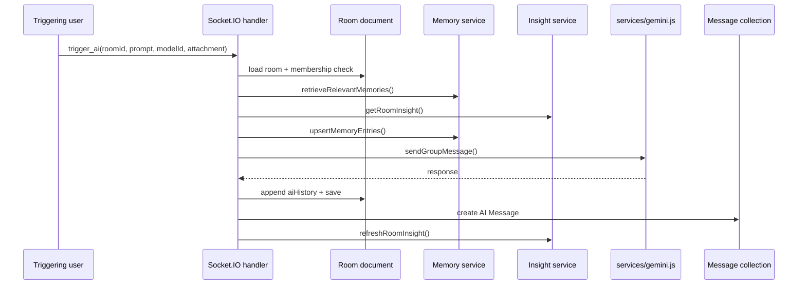

# 05. Socket AI Overview

## Purpose
This document explains how room AI works over Socket.IO, which events matter, and how state, storage, and broadcasts interact.

## Main Event
The AI room interaction is centered on:

- `trigger_ai`

The response side uses:

- `ai_thinking`
- `ai_response`
- `error_message`

## High-Level Event Flow

## Risks
- no transaction across room save and message save
- quota and room state are instance-local
- synchronous provider latency blocks the socket handler

