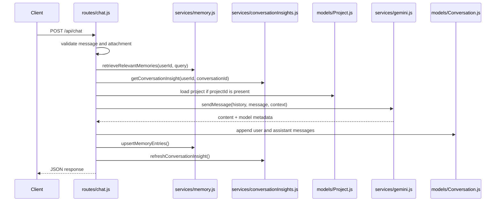

# 06. Solo Chat Flow

## Purpose
This document explains the end-to-end solo AI chat flow implemented in `routes/chat.js`.

## Relevant Files
- `routes/chat.js`
- `services/gemini.js`
- `services/memory.js`
- `services/conversationInsights.js`
- `models/Conversation.js`
- `models/Project.js`

## End-to-End Flow

## Database Writes
`POST /api/chat` performs these writes:

- `Conversation.save()`
- `upsertMemoryEntries(...)`
- `markMemoriesUsed(...)`
- `refreshConversationInsight(...)`

## Failure Cases
| Failure | Behavior |
|---|---|
| invalid attachment | `400` |
| missing message | `400` |
| project not found | `404` |
| provider unavailable | `503` |
| other error | `500` |

