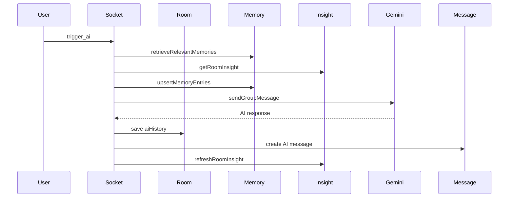

# 07. Room AI Flow

## Purpose
This document explains the room-based AI feature implemented inside the Socket.IO section of `index.js`.

## Relevant Files
- `index.js`
- `services/gemini.js`
- `services/memory.js`
- `services/conversationInsights.js`
- `models/Room.js`
- `models/Message.js`

## Execution Steps
1. flood control check
2. prompt and attachment validation
3. emit `ai_thinking`
4. consume AI quota
5. load room and confirm membership
6. retrieve memories and room insight
7. upsert memories from prompt
8. call `sendGroupMessage(...)`
9. append `Room.aiHistory`
10. create AI `Message`
11. mark memories used
12. refresh room insight
13. emit `ai_response`

## Sequence Diagram

## Risks
- no transaction across room save and message save
- synchronous provider latency blocks the socket handler

