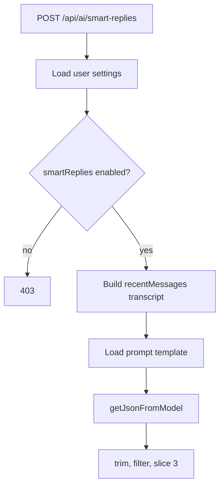

# 08. Smart Replies Flow

## Purpose
This document explains the `/api/ai/smart-replies` helper feature.

## Relevant Files
- `routes/ai.js`
- `services/gemini.js`
- `services/promptCatalog.js`
- `models/User.js`

## Execution Logic
1. load user AI settings
2. reject if `smartReplies` is disabled
3. normalize the last six messages into a compact transcript
4. load prompt template `smart-replies`
5. call `getJsonFromModel(...)`
6. if parsing fails, use deterministic fallback replies
7. normalize to exactly three strings

## Flow Diagram

