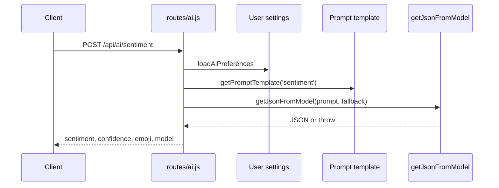

# 09. Sentiment Flow

## Purpose
This document explains the `/api/ai/sentiment` feature.

## Relevant Files
- `routes/ai.js`
- `services/gemini.js`
- `services/promptCatalog.js`
- `models/User.js`

## Execution Path

## Fallback
If generation or parsing fails, the route falls back to:

- `sentiment: neutral`
- `confidence: 0.5`
- `emoji: :|`

