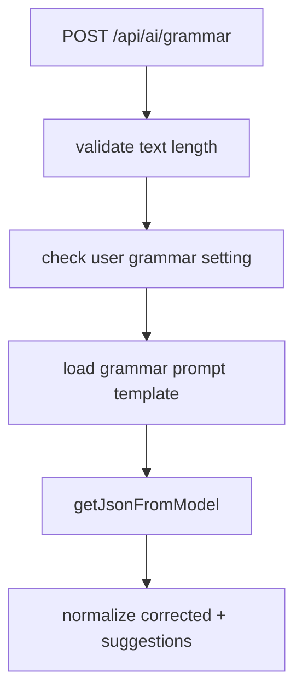

# 10. Grammar Flow

## Purpose
This document explains the `/api/ai/grammar` helper feature.

## Relevant Files
- `routes/ai.js`
- `services/gemini.js`
- `services/promptCatalog.js`
- `models/User.js`

## Execution Logic
1. load user AI settings
2. reject if grammar is disabled
3. load `grammar` prompt template
4. ask the model for JSON with `corrected` and `suggestions`
5. if model call fails, use fallback with original text and empty suggestions

## Flow Diagram

