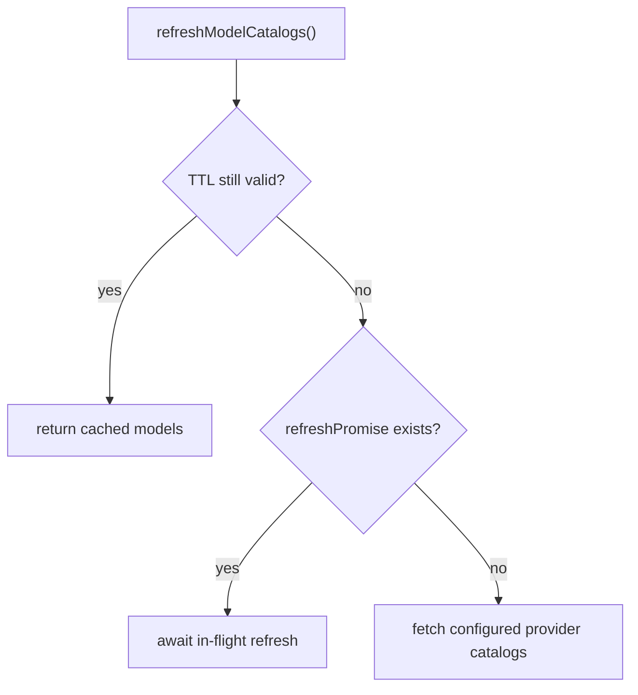

# 11. Model Catalog and Discovery

## Purpose
This document explains how the backend discovers available AI models, caches catalogs, and exposes model choices to clients.

## Relevant Files
- `services/gemini.js`
- `routes/ai.js`

## Catalog State
`services/gemini.js` stores runtime catalog state in memory:

- `openrouter`
- `gemini`
- `grok`
- `together`
- `groq`
- `lastRefreshedAt`
- `refreshPromise`

## Refresh Behavior

