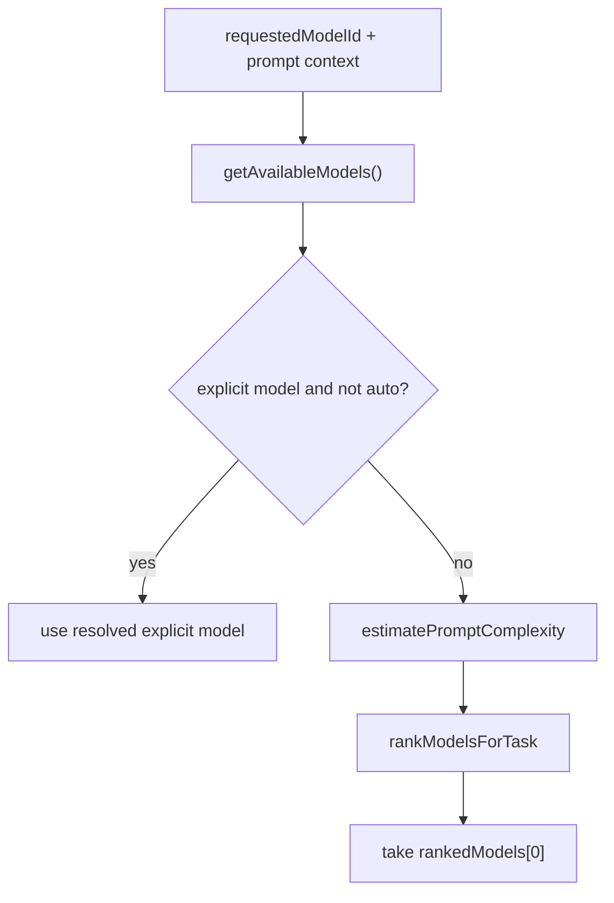

# 12. Auto Routing and Model Selection

## Purpose
This document explains how the backend chooses a model when the caller requests `auto` or omits a model id.

## Relevant Files
- `services/gemini.js`

## Core Functions
- `estimatePromptComplexity`
- `rankModelsForTask`
- `resolveTaskModel`
- `resolveModel`

## Routing Flow

