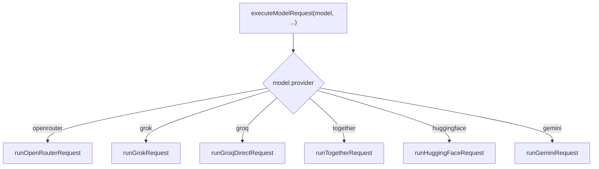

# 13. Provider Adapters

## Purpose
This document explains how each AI provider is called from `services/gemini.js`.

## Relevant Files
- `services/gemini.js`

## Provider Functions
- `runOpenRouterRequest`
- `runGrokRequest`
- `runHuggingFaceRequest`
- `runTogetherRequest`
- `runGroqDirectRequest`
- `runGeminiRequest`

## Adapter Pattern

