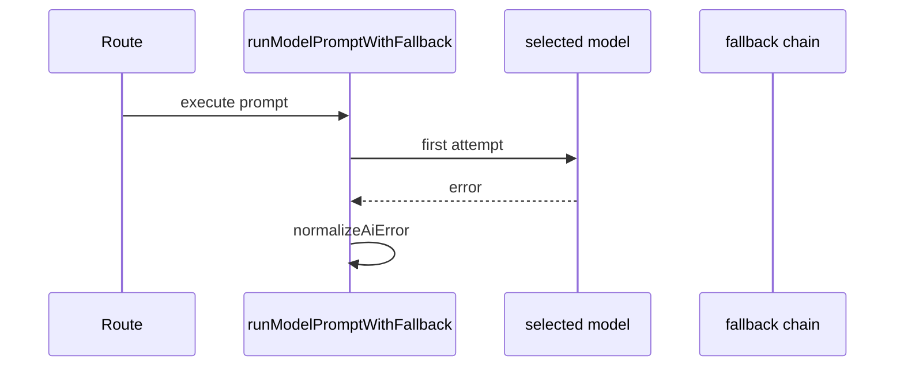

# 14. Fallback and Error Normalization

## Purpose
This document explains how the backend handles provider failures, rate limits, invalid models, and offline fallback behavior.

## Relevant Files
- `services/gemini.js`
- `routes/chat.js`
- `routes/ai.js`

## Core Helpers
- `extractStatusCode`
- `extractRetryAfterMs`
- `normalizeAiError`
- `buildOfflineFallbackResponse`
- `runModelPromptWithFallback`

## Retry Flow

