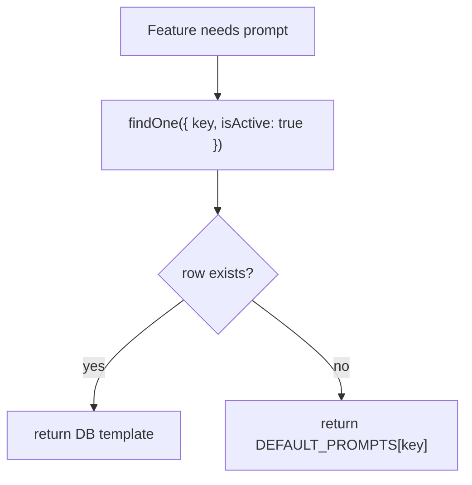

# 16. Prompt Template System

## Purpose
This document explains how prompt templates are defined, loaded, overridden, and consumed by AI features.

## Relevant Files
- `services/promptCatalog.js`
- `models/PromptTemplate.js`
- `routes/admin.js`

## Default Template Keys
- `solo-chat`
- `group-chat`
- `memory-extract`
- `conversation-insight`
- `smart-replies`
- `sentiment`
- `grammar`

## Template Loading Flow

