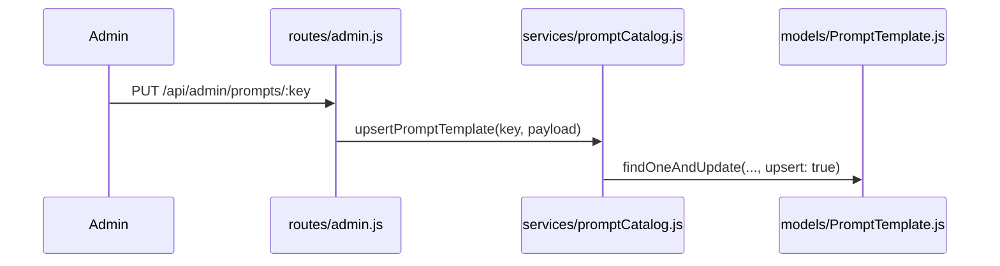

# 17. Admin Prompt Management

## Purpose
This document explains how administrators inspect and modify prompt templates.

## Relevant Files
- `routes/admin.js`
- `services/promptCatalog.js`
- `models/PromptTemplate.js`

## Endpoints
| Method | Path | Purpose |
|---|---|---|
| `GET` | `/api/admin/prompts` | list templates |
| `PUT` | `/api/admin/prompts/:key` | update or create template content |

## Write Path

