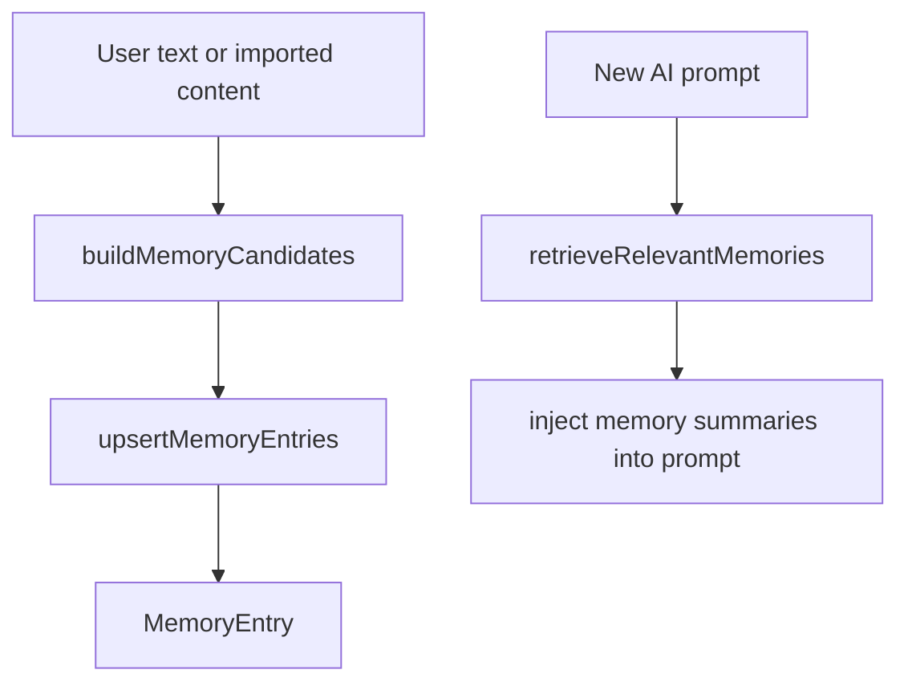

# 18. Memory System Overview

## Purpose
This document explains why the backend has a memory layer, what kind of data it stores, and where it participates in AI flows.

## Relevant Files
- `services/memory.js`
- `routes/chat.js`
- `index.js`
- `routes/memory.js`
- `services/importExport.js`
- `models/MemoryEntry.js`

## Memory Lifecycle

## Risks
- regex extraction can miss subtle memories
- AI extraction can hallucinate
- retrieval is lexical, not semantic

