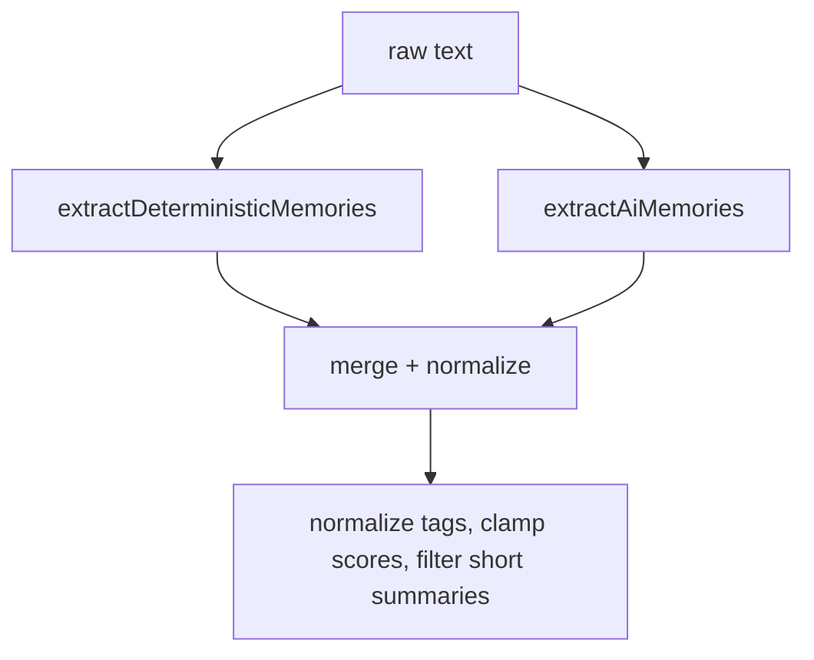

# 19. Memory Extraction

## Purpose
This document explains how the system extracts memory candidates from user text.

## Relevant Files
- `services/memory.js`
- `services/gemini.js`

## Two Extraction Modes
- deterministic regex-based extraction
- AI-assisted extraction via `getJsonFromModel`

## Extraction Pipeline

