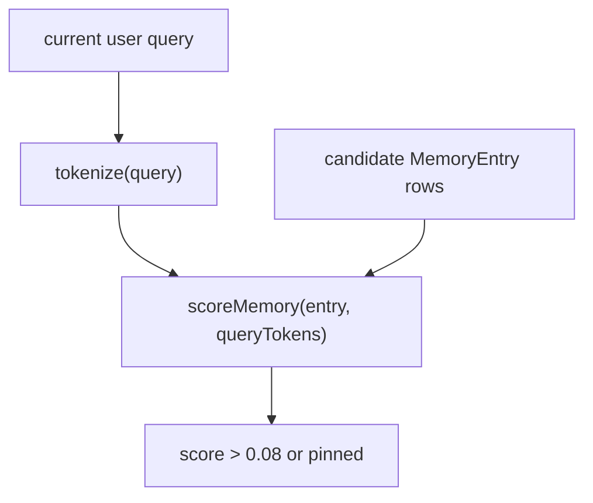

# 20. Memory Retrieval and Scoring

## Purpose
This document explains how stored memories are ranked and selected for reuse in prompts.

## Relevant Files
- `services/memory.js`
- `models/MemoryEntry.js`

## Retrieval Strategy
1. load up to 100 recent memories for a user
2. tokenize the current query
3. score each memory
4. filter low-score entries unless pinned
5. sort descending
6. take top N

## Retrieval Diagram

